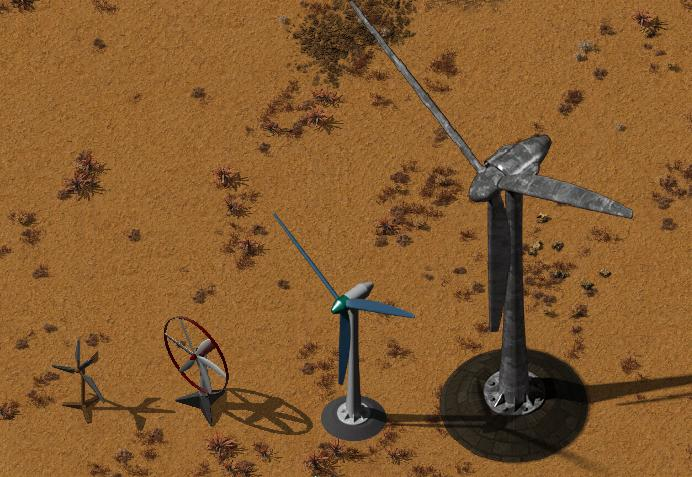

# Wind Turbines relaunched
## Features
Wind Turbines produce free energy, but are expensive to build and don't have a steady output.
This mod adds 4 tiers of turbines, from a small wooden windmill to a titanic steel and refined concrete turbine.

- Alternative/complement to solar panel arrays, similar large upfront cost but free energy after
- The higher tier versions save a lot of space compared to solar panel arrays
- You can walk around the base tower, but you cannot build there (to avoid objects getting hidden behind the large graphics)

----
## Relaunch of Wind Turbines from wavtrex with the necessary patches for V 2.0 of factorio.
This mod is intended as inplace replacement for [Wind_Generator-gfxrestyle](https://mods.factorio.com/mod/Wind_Generator-gfxrestyle) 
which is no longer compatible with V 2.0 of factorio.
